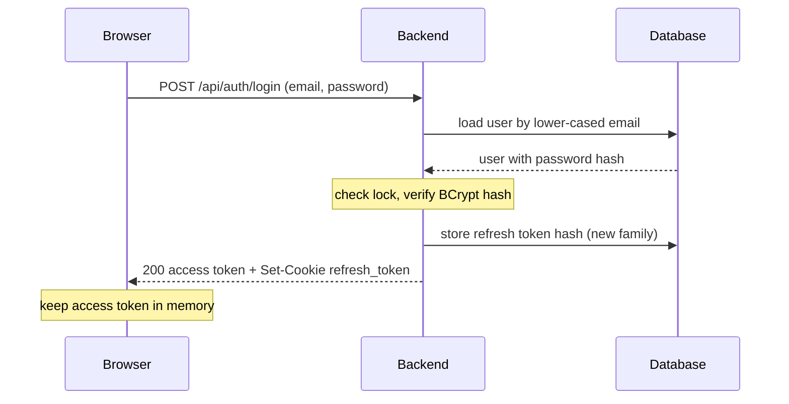
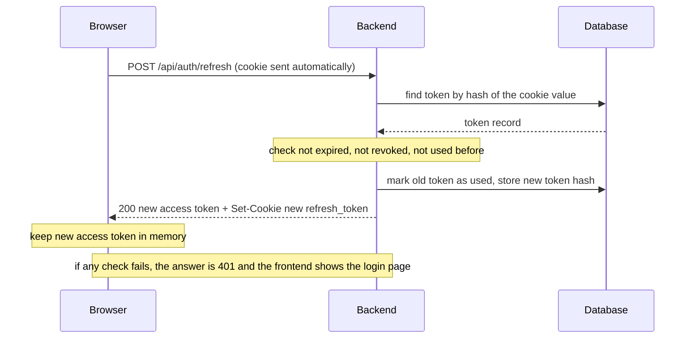

# Architecture

## Login

```mermaid
sequenceDiagram
    participant B as Browser
    participant S as Backend
    participant D as Database
    B->>S: POST /api/auth/login (email, password)
    S->>D: load user by lower-cased email
    D-->>S: user with password hash
    Note over S: check lock, verify BCrypt hash
    S->>D: store refresh token hash (new family)
    S-->>B: 200 access token + Set-Cookie refresh_token
    Note over B: keep access token in memory
```

## Token refresh

```mermaid
sequenceDiagram
    participant B as Browser
    participant S as Backend
    participant D as Database
    B->>S: POST /api/auth/refresh (cookie sent automatically)
    S->>D: find token by hash of the cookie value
    D-->>S: token record
    Note over S: check not expired, not revoked, not used before
    S->>D: mark old token as used, store new token hash
    S-->>B: 200 new access token + Set-Cookie new refresh_token
    Note over B: keep new access token in memory
    Note over B,S: if any check fails, the answer is 401 and the frontend shows the login page
```
